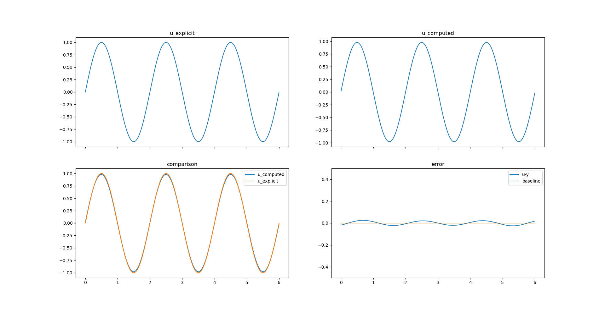

# difference_equation
微分方程数值解法 实验 基于Python的实现


## HOW TO RUN THIS PROJECT

1. In bash, run the following instruction to install all the requirements.
```bash
    pip install -r requirement.txt
```

2. Modify the file *function.py* to choose the function you want to verify.

3. Modify the file *config.conf* to adjust the parameters.

4. Run:
```bash
    python index.py
```

5. In result, the program will auto draw the figure it computed.

