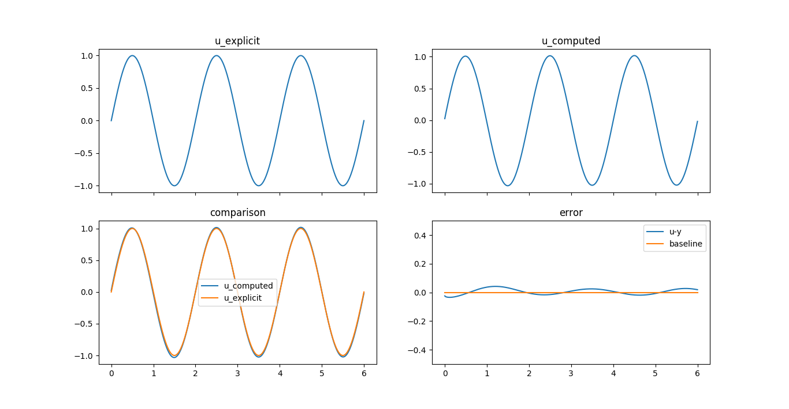
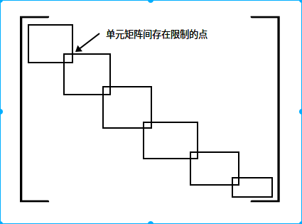
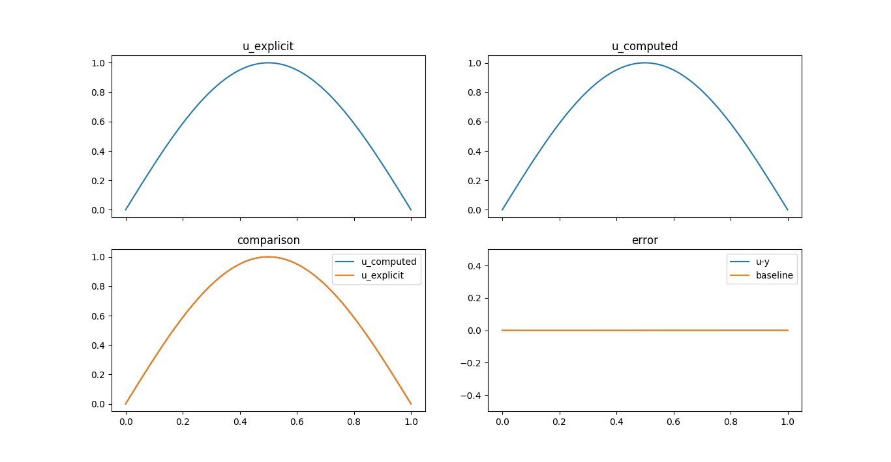
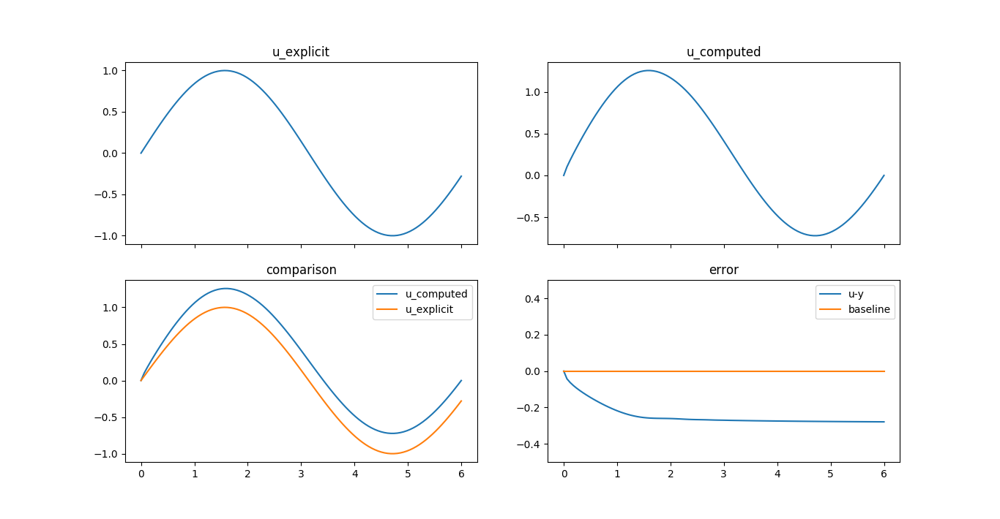

# 微分方程数值解法 第一次 实验报告
<div align="right">信息与计算科学</div>
<div align="right">15336204</div>
<div align="right">邢剑飞</div>

***

## 一、问题

利用有限元方法解微分方程

$- {d \over dx}(p{du \over dx})+qu = f$

$where \  u(a) = 0, \ u'(b) = 0$

## 二、理论分析

为方便表示，用以下方程代替上述微分方程

$-(pu')'+qu=f$

两端同时乘$v$,化为变分形式

$\int _a^b(-p'u'-pu''+qu)vdx=\int _a^bfvdx$

$-\int _a^bp'u'vdx-\int_a^bpu''vdx+\int_a^bquvdx=\int_a^bfvdx$

利用分部积分公式，进一步化简

$-\int_a^bp'u'vdx-(u'pv|_a^b-\int_a^b(pv)'u'dx)+\int_a^bquvdx = \int_a^bfvdx$

$-\int_a^bp'u'vdx-u'pv|_a^b+\int_a^bp'u'vdx+\int_a^bpu'v'dx+\int_a^bquvdx = \int_a^bfvdx$

$-u'pv|_a^b+\int_a^bpu'v'dx+\int_a^bquvdx = \int_a^bfvdx$

代入边界条件得

$\int_a^bpu'v'dx+\int_a^bquvdx = \int_a^bfvdx$

由插值公式知道

$u(x)=\Sigma_{i=1}^nu_i\varphi_i(x)$

其中，$\varphi_i(x)$为插值基函数

将上式代入原式中，令$v(x)=\varphi(x)$，得到

$\int_a^bp(\Sigma_{i=1}^nu_i\varphi_i(x))'\varphi_j'(x)dx + \int_a^bq\Sigma_{i=1}^nu_i\varphi_i(x)\varphi_j(x)dx = \int_a^bf\varphi_j(x)dx$

整理得

$\Sigma_{i=1}^nu_i(\int_a^bp\varphi_i'\varphi_j'dx+\int_a^bq\varphi_i\varphi_jdx)=\int_a^bf\varphi_jdx$

因此，函数的解可以表示为

$Au=F$

其中，

$u = (u_1, u_2, \cdots, u_n)^T$

$F = ((f,\varphi_1), (f, \varphi_2), \cdots, (f,\varphi_n))^T$

$A = A^1+A^2$

$A_1$为刚度矩阵，$A_2$为质量矩阵，表示为

$A^1_{ji}=\int_a^bp\varphi_i'\varphi_j'dx$

$A^2_{ji}=\int_a^bq\varphi_i\varphi_jdx$

$A$为三对角矩阵，一定是可逆的，计算时只要求解以下方程

$u=A^{-1}F$

便可以得到$u(x)$在$x_i$处的近似值

## 三、实验相关说明

1. 开发环境: Linux version 4.10.0-42-generic
2. 语言: Python >= 3.5.0
3. 目录树：

```
    .
    ├─── static/            # 静态文件目录
    ├─── config.conf        # 配置文件，包含具体参数，如目标端点值，步长等
    ├─── config_parser.py   # 配置文件驱动
    ├─── function.py        # 函数信息配置，运行时需要手动进行修改
    ├─── index.py           # 入口文件
    ├─── integration.py     # 功能：数值积分
    ├─── README.md          # 运行指南
    └─── requirement.txt    # 依赖包记录
```

全部实验代码存放于

https://github.com/Jianfei2333/difference_equation

## 四、运行说明

运行前，可以手动调整各个函数及参数的值。函数存放于/function.py中，参数存放于/config.conf中。

其中函数配置部分包括待求函数真实表达式，其一阶、二阶导数表达式；$p(x)$,$q(x)$表达式及$p(x)$的一阶导数表达式。这些函数需要同步进行(手动)修改，如果不匹配可能导致很糟糕的结果。其他部分通过调用方式使用上面的函数，不需要进行手动的修改。

由于版本的关系，一些依赖包和语法在Python2.7及以下不能正常运行，请确保在Python3.5及以上的环境下使用pip安装依赖和运行程序。

## 五、实验结果

使用的测试函数为

$u(x)=sin(\pi x)$

$p(x)=x^2$

$q(x)=sin(e^x)$

得到结果如下图：



图左上：$u(x)$实际图像

图右上：经过解微分方程得到的$u(x)$图像

图左下：两个图像合并于同一坐标系下图像

图右下：误差图像($u-y$关于$x$)

拟合度较好，平均误差值约为0.0063

***
...一些题外话

Python环境真的难搭Orz，各种版本冲突语法规则冲突，如果实在不能运行的话可以发邮件给我2333，邮箱：xjf999999@hotmail.com

BTW虽然感觉有点紧张但是助教姐姐依然很努力地在讲课啦！其实讲得非常清楚了(虽然大家好像都没有什么反应...其实所有课都是这个状况2333 反正希望助教姐姐以后也一定要加油啦！(≧∇≦)ﾉ

***
<h5 align="right">2018年03月31日 星期六 17:54:13 CST</h5>

***
## 算法设计：

算法核心为解一个矩阵方程

$Au=F$

而全过程中最主要的部分是刚度矩阵$A$的设计。可以利用单元刚度矩阵拼接的方式获得$A$，具体如下：

1. 如何获得单元刚度矩阵
    > 假设我们使用一维k次元，其基函数表达为$\varphi_{il}$，其中$i=1,2,\cdots,n$，表示$[x_{i-1}, x_{i}]$; $l=0,1,\cdots,k$，表示$[x_{i-1}, x_{i}]$上第$l$个小分点对应的基函数，其仿射变换到参考区间$[0,1]$上，参考区间的基函数为:
    >
    > $\varphi_{l}^{[0,1]}(\xi)=\Pi_{t=0,t \ne l}^{k}{\xi-\xi_t \over \xi_l-\xi_t}$,其中$\xi_l={l \over k}$
    >
    > 仿射变换为：
    >
    > $\xi={x-x_{i-1} \over x_i-x_{i-1}}$
    >
    > 将其带回基函数便可得到$\varphi_{il}^{[x_{i-1},x_i]}(x)$的表达式
    >
    > 单元刚度矩阵的方程表示为$K_i u = F_i$,其中
    >
    > $F_i = ((f,\varphi_{i0}),(f,\varphi_{i1}),\cdots,(f,\varphi_{ik}))^T$

2. 拼接规则
    > 首先考虑自由度。将$[c,d]$剖分为了$n$个区间，每个区间上有$k+1$个基函数，所以首先有$n(k+1)=nk+n$个自由度。再考虑其他限制条件
    > 1. 边界值已经限定
    > 2. 相邻区间的首末端点重合，所以要求相邻区间计算的端点值一致
    >
    > 由以上两个条件得出$n+1$个限制，因此总自由度为$nk-1$
    >
    > 再考虑拼接问题。约定$x_j,j=1,\cdots,N(=nk-1)$为实际的剖分点,显然$x_{tk},t=1,\cdots,k-1$为第一层剖分的分点。由于限制条件在这些点上，其他点并不存在限制，所以对于任意$j\ne tk$的点，只有它所在的一层剖分区间上的基函数会对其产生影响，而其他区间不会，所以这一行其他区间对应的系数显然为0。
    > 对于$j=tk$的点，不妨表示为$x_i$，则有来自$[x_{i-1},x_{i}]$的一个方程$\lambda_1 u=(f,\varphi_{ik})$，来自$[x_i,x_{i+1}]$的一个方程$\lambda_2 u = (f, \varphi_{(i+1)0})$。要使二者统一，只需相加即可。即$(\lambda_1+\lambda_2)u=(f,\varphi_{ik})+(f, \varphi_{(i+1)0})$。
    >
    > 下图从分块矩阵的角度描述了上述过程。
    >
    > 

至此，我们便可以得到拼接的刚度矩阵$A$和方程的右端$F$，解此方程即可。

本实验改进后的方案如上描述。添加端点值后编码实现即可。



利用改进后的算法计算结果如上图。平均误差水平为1e-5。

## 尚存在的问题：

这套算法只适用于左右两点边值均为0的状况(不知道为什么)。当某一点边界值不是0时，计算结果存在很大的偏差，如下图所示。


***
<h5 align="right">更新于 2018年04月02日 星期一 18:27:21 CST</h5>