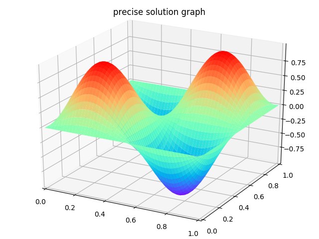
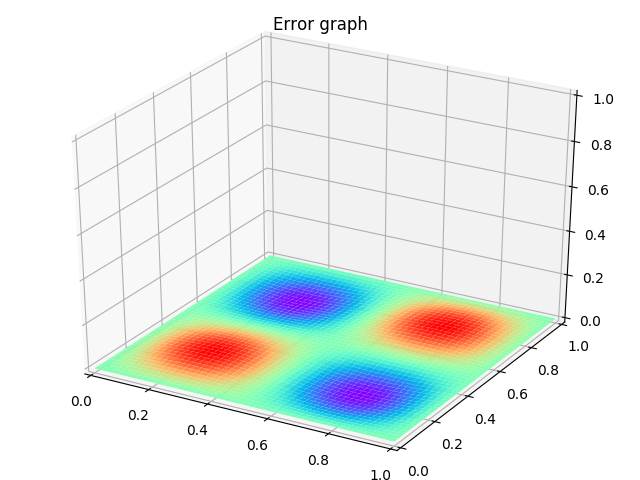

#微分方程数值解法 第三次实验

15336204 邢剑飞 信息与计算科学

##一、问题

​	求解二维偏微分方程：
$$
-\Delta u = f \\
where \ u: \ P \rightarrow \Bbb{R}, \ P \subseteq \Bbb{R}^2, \\
u(x) = g(x), for \ x \in \partial P
$$

​	为简化问题，求解以下方程：
$$
-\Delta u(x,y) = f \\
 where\  f = -8\pi^2\cdot sin(2\pi\cdot x)sin(2\pi\cdot y) , \\
x \in [0,1], y \in [0,1] \\
 u(x,y) = 0  \ on\ \partial P
$$
​	其精确解为：
$$
u = sin(2\pi\cdot x)sin(2\pi\cdot y)
$$

## 二、实验原理和实现分析

​	与一维情况类似，利用有限元方法
$$
\int -\Delta u \cdot v = \int f\cdot v \Rightarrow \\
\int \nabla u \cdot \nabla v = \int f \cdot v
$$
​	设基函数为$\varphi_i$，则有：
$$
u(x,y) = \Sigma_i u_i \cdot \varphi_i
$$
​	将上式代回(4)，令$v=\varphi$，则可以得到：
$$
\Sigma_j u_j\cdot a(\varphi_j, \varphi_i) = (f,\varphi_i), \ i = 1,2,...,N \\
where\ a(\varphi_i, \varphi_j) = \int_P \nabla\varphi_i\cdot\nabla\varphi_j, \\
(f,\varphi_i) = \int_P f\cdot\varphi_i dxdy
$$

​	实现时，利用单元刚度矩阵：将区域$P$剖分，假设使用正方形网格，其中第$i$个网格上的基函数分别为$\varphi_i^{(1)},\varphi_i^{(2)},\varphi_i^{(3)},\varphi_i^{(4)}$

​	将网格映射到单位单元上，基函数命名为：$\psi^{(1)}(\xi,\eta),\psi^{(2)}(\xi,\eta),\psi^{(3)}(\xi,\eta),\psi^{(4)}(\xi,\eta)$

​	显然有以下关系成立：
$$
\psi^{(1)}(0,0) = 1, \psi^{(1)}(1,0)=\psi^{(1)}(1,1)=\psi^{(1)}(0,1) = 0; \\
\psi^{(2)}(1,0) = 1, \psi^{(2)}(0,0)=\psi^{(2)}(1,1)=\psi^{(2)}(0,1) = 0; \\
\psi^{(3)}(1,1) = 1, \psi^{(3)}(1,0)=\psi^{(3)}(0,0)=\psi^{(3)}(0,1) = 0; \\
\psi^{(4)}(0,1) = 1, \psi^{(4)}(1,0)=\psi^{(4)}(1,1)=\psi^{(4)}(0,0) = 0;
$$
​	故可表示为：
$$
\psi^{(1)}(\xi,\eta) = (1-\xi)\cdot(1-\eta)=1-\xi-\eta+\xi\cdot\eta, \\
\psi^{(2)}(\xi,\eta) = \xi\cdot(1-\eta), \\
\psi^{(3)}(\xi,\eta) = \xi\cdot\eta, \\
\psi^{(4)}(\xi,\eta) = (1-\xi)\cdot\eta
$$
​	求单元刚度矩阵：
$$
a(\psi^{(1)},\psi^{(1)}) = \int_{P_0}(1-\xi)^2+(1-\eta)^2 d\xi d\eta = {2 \over 3}
$$
​	类似可得到：
$$
a(\psi^{(2)},\psi^{(2)}) = a(\psi^{(3)},\psi^{(3)}) = a(\psi^{(4)},\psi^{(4)}) = {2\over3} \\
a(\psi^{(1)},\psi^{(2)}) = a(\psi^{(2)},\psi^{(3)}) = a(\psi^{(3)},\psi^{(4)}) = a(\psi^{(1)},\psi^{(4)}) = -{1\over6} \\
a(\psi^{(1)},\psi^{(3)}) = a(\psi^{(2)},\psi^{(4)}) = -{1\over3}
$$
​	再由矩阵对称性便可以得到整个单元刚度矩阵，得到
$$
\left[
 \begin{matrix}   
   2\over3 & -{1\over6} & -{1\over3} & -{1\over6}\\
   -{1\over6} & 2\over3 & -{1\over6} & -{1\over3}\\
   -{1\over3} & -{1\over6} & 2\over3 & -{1\over6}\\
   -{1\over6} & -{1\over3} & -{1\over6} & 2\over3
  \end{matrix}
  \right]
$$
​	通过仿射变换将单元网格映射到分割的某个网格，映射为：
$$
T:(\xi,\eta) \rightarrow (x,y) \\
s.t. \ \xi = {{x-x_1} \over {x_2-x_1}}, \\
\eta = {{y-y_1} \over {y_2-y_1}}
$$

​	之后，将单元刚度矩阵组装成总体刚度矩阵，以某个节点为例：   

​	对于$N_1$来说，对其产生影响的网格只有其周围的八个节点，分别标记为$N_2 -N_9$。采用一维类似的影响叠加的方法，有
$$
\Sigma_{i=1}^9 a_i^{N_1}\cdot u_i = \Sigma_{A,B,C,D}\int f\cdot \psi_\Omega^{N_1} d\xi d\eta
$$
​	其中$\psi_\Omega^{N_1}$表示区域$\Omega$在节点$N_1$的基函数，由于其他区域均不会对$N_1$产生影响，$\Omega$只可以取$A,B,C,D$

​	于是有如下成立：
$$
a_1^{N_1} = {2\over3}\cdot4 = {8\over3} \\
a_2^{N_1} = a_4^{N_1} = a_6^{N_1} = a_8^{N_1} = -{1\over3} \\
a_3^{N_1} = a_5^{N_1} = a_7^{N_1} = a_9^{N_1} = -{1\over6}\cdot2 = -{1\over3}
$$
​	因此，对于整体来讲，有
$$
{1 \over 3 }\cdot (8 u_1-u_2-u_3-u_4-u_5-u_6-u_7-u_8-u_9) = \int f\cdot(\psi_A^{(3)}+\psi_B^{(4)}+\psi_C^{(1)}+\psi_D^{(2)})d\xi d\eta
$$
​	至于存储方式，由于网格节点是二维的，但每个节点在总体刚度矩阵中只有一行，因此需要进行一次角标的映射。规则如下：

​	$N_{ij}$表示第$i$行第$j$列的节点。其在总体刚度矩阵中的序号$t$为：
$$
t_{ij} = i\cdot N + j
$$
​	其中，$N$为行剖分的区域数量。

​	$N_{i_2 j_2}$对$N_{i_1 j_1}$节点的影响可以表示为刚度矩阵的元素$A[t_{11},t_{22}]$。下面分为内部节点和边界节点两方面进行考虑：

  1. 内部节点：

     当且仅当$|i_1-i_2| \le 1, |j_1-j_2| \le 1$时，两节点才会有影响，其他情况不相邻，故不会产生影响，对应刚度矩阵元素为0；对于互相影响的节点，将矩阵对应元素值赋为系数即可。

  2. 边界节点：

     边界节点满足的条件为：$i = 0，i=N-1$或$j=0,j=N-1$。对于这些位置，由于边界的约束条件
     $$
     u(p) = g(p), \ where \ p \in \partial P
     $$
     只要令刚度矩阵对应元素赋值为1，右端赋值为$g(p)$，也就是
     $$
     A[i_p\cdot N+j_p][i_p\cdot N + j_p] = 1, \\
     F[i_p\cdot N + j_p] = g(p)
     $$
     ​

     即可。

     在实现过程中，由于刚度矩阵过大，以标准的矩阵形式保存消耗较大，不可取。可以利用稀疏矩阵保存。问题最终转化为解以下方程：
     $$
     A\cdot u = F \\
     where \ A \ satisfy \ (17) (18) \\
     F_i \ satisfy \ (15) RHS\ for\ p_i \in P \backslash\partial P, \ (18) \ for \ p_i \in \partial P
     $$
     ​

     ​	

## 三、实验过程和结果

 1. 实验环境：Linux 4.13.0-39-generic x86_64 GNU/Linux，Python version 3.6.3。其他依赖包及版本在根目录下requirement.txt中定义。

 2. 实验结果：

    利用泊松方程测试，剖分网格选为矩形网格，每个维度剖分为50份。

    下图为精确结果（3）的图像

    

​	下图为利用有限元方法求得的结果的图像：

​	

​	下图为二者的误差分布图像：

​	

​	平均误差计算结果为0.00830287883352228，拟合程度比较好。

​	备注：剖分为50份在绘图时压力可能较大，可以选择减少剖分网格数量来加速运行。网格数量定义在/index.py中。

​	测试时可能需要修改的参数：

​	/function.py中的方程RHS，u的精确解

​	/index.py中的剖分网格数

------

2018年 04月 28日 星期六 09:33:15 CST